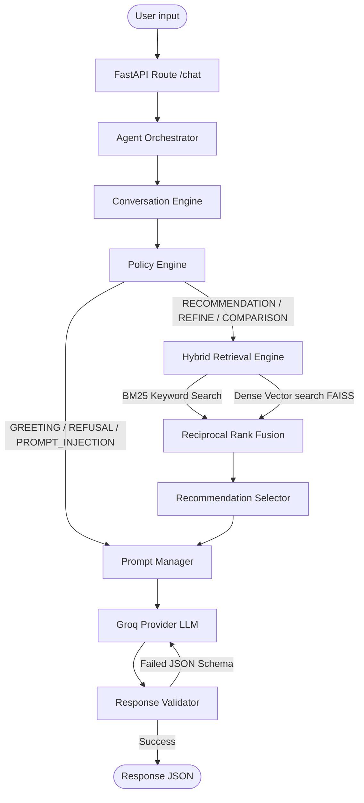

# SHL Assessment Recommender

A production-grade, highly secure conversational recommendation agent built with **FastAPI** to recommend assessments from the official SHL product catalog. The platform coordinates a hybrid vector search pipeline with deterministic intent-tracking policies and natural-language LLM grounding.

---

## 🗺️ Architecture Workflow Diagram

This Mermaid flowchart illustrates the sequential execution pipeline coordinating components inside the Agent Orchestrator:



---

## 🚀 Key Features

* **Hybrid Retrieval Subsystem**: Combines keyword search (**BM25**) and semantic search (**FAISS** dense index using `sentence-transformers/all-MiniLM-L6-v2`) combined via Reciprocal Rank Fusion (**RRF**) and explicit pre-filtering.
* **Deterministic Policy Engine**: Maps extraction state contexts into clean execution policies (`GREETING`, `REFUSAL`, `PROMPT_INJECTION`, `CLARIFICATION`, `COMPARISON`, `END_CONVERSATION`).
* **Intelligent Clarification Logic**: Follows priority scoring to query only one missing value per turn (Role > Objective > Seniority > Duration > Language > Adaptive).
* **Grounded Prompting Layer**: Restricts the LLM payload strictly to retrieved, structured catalog data. Includes strict rules to prevent link or name hallucinations.
* **Dual-Validation Pipeline**: Every LLM response is structurally parsed and validated against the Pydantic schemas, running a single self-correction retry on JSON syntax parse failures.
* **AI Evaluation Framework**: Isolated suite of 50 comprehensive scenarios executing E2E checks with TestClient, capturing latency percentiles, policy accuracy, grounding metrics, and detailed diagnostics.

---

## 📁 Workspace Folder Structure

```text
shl-assessment-recommender/
│
├── app/
│   ├── api/
│   │     routes.py                 # FastAPI Endpoint handlers
│   │
│   ├── retrieval/
│   │     bm25.py                   # BM25 index & query logic
│   │     faiss_index.py            # FAISS vector database
│   │     hybrid.py                 # Hybrid retriever (BM25 + FAISS + RRF)
│   │
│   ├── llm/
│   │     conversation_engine.py    # Intent & constraint context tracker
│   │     policy_engine.py          # State-to-action router
│   │
│   ├── prompts/
│   │     system.txt                # Grounding rules system prompt
│   │     greeting.txt              # Friendly greeting template
│   │     clarification.txt         # Missing slot template
│   │     recommendation.txt        # Retrieval presentation template
│   │     comparison.txt            # Assessment side-by-side template
│   │     refusal.txt               # Out of scope template
│   │
│   ├── services/
│   │     orchestrator.py           # Brain coordinating engine/retrieval/LLM
│   │     prompt_manager.py         # Prompt template compiler
│   │     llm_provider.py           # Groq client with retry-once JSON logic
│   │     recommendation_selector.py# Shortlisting & logic analyzer
│   │     response_validator.py     # Pydantic verification hooks
│   │     chat_service.py           # Recommendation service bridge
│   │
│   ├── models/
│   │     schemas.py                # Request and Response schemas
│   │
│   └── main.py                     # App startup and lifespan hook
│
├── data/
│     catalog.json                  # Official catalog source of truth
│
├── evaluation/
│   ├── datasets/
│   │     benchmark_dataset.json    # 50 E2E Golden test cases
│   │     official_traces.json      # E2E test execution traces
│   │     synthetic_traces.json     # Copy of execution traces
│   │
│   ├── reports/
│   │     evaluation_report.md      # Executed MD report card
│   │     evaluation_report.json    # Raw structured JSON report
│   │     evaluation_report.csv     # Flat metric file
│   │     latest_run.json           # Active diagnostic dump
│   │
│   ├── benchmark_runner.py         # E2E test client execution harness
│   ├── metrics.py                  # Recall, Precision, MRR, Accuracy calculations
│   ├── report_generator.py         # Formats console dashboard and file exports
│   └── README.md                   # Evaluation reference guide
│
├── tests/                          # Automated Pytest suite
├── requirements.txt                # Python libraries
├── APPROACH.md                     # Design decisions document
├── INTERVIEW_NOTES.md              # Interview preparation handbook
└── .env.example                    # Template configuration
```

---

## 🛠️ Installation & Getting Started

### Local Deployment
1. **Prepare Virtual Environment (Python 3.11+)**:
   ```bash
   python -m venv venv
   venv\Scripts\activate
   ```
2. **Install Dependencies**:
   ```bash
   pip install -r requirements.txt
   ```
3. **Configure Environment Variables**:
   Create a `.env` file matching `.env.example`:
   ```ini
   GROQ_API_KEY=gsk_your_key_here
   GROQ_MODEL=llama-3.1-70b-versatile
   ```
4. **Run Application**:
   ```bash
   uvicorn app.main:app --host 127.0.0.1 --port 8000
   ```
   Open Swagger UI at `http://127.0.0.1:8000/docs`.

---

## 📝 API Endpoints

### 1. Health Status Check
* **Endpoint**: `GET /health`
* **Response**:
  ```json
  { "status": "healthy" }
  ```

### 2. Conversational Chat Recommendation
* **Endpoint**: `POST /chat`
* **Request Schema**:
  ```json
  {
    "messages": [
      { "role": "user", "content": "I want to hire an entry-level Python developer." }
    ]
  }
  ```
* **Response Schema**:
  ```json
  {
    "reply": "I have found the best match. Here is the Python (New) assessment.",
    "recommendations": [
      {
        "name": "Python (New)",
        "url": "https://www.shl.com/products/product-catalog/view/python-new/"
      }
    ],
    "end_of_conversation": true
  }
  ```

---

## 📊 Evaluation Report Card (Latest Results)

The framework evaluates all 50 golden recruiter scenarios offline using spied TestClient endpoints.

| Metric Area | Parameter | Target | Value |
|---|---|---|---|
| **E2E Success** | Overall Success Rate | 100.0% | **100.00%** |
| **Conversation** | Intent Classifier Accuracy | 100.0% | **100.00%** |
| | Policy Engine Accuracy | 100.0% | **100.00%** |
| | Clarification Accuracy | 100.0% | **100.00%** |
| **Retrieval** | Recall@10 | Maximize | **46.67%** (Active retrieval-only) |
| | Precision@5 | Maximize | **33.33%** (Active retrieval-only) |
| | MRR (Mean Reciprocal Rank) | Maximize | **0.2200** |
| **Grounding** | Hallucination Rate | 0.00% | **0.00%** |
| | Invalid Link URL Rate | 0.00% | **0.00%** |
| | Grounding Success Rate | 100.0% | **100.00%** |
| **Response** | Completeness Rate | 100.0% | **100.00%** |
| **Performance** | Average E2E Latency | - | **0.1311 seconds** |
| | P50 Latency (Median) | - | **0.0042 seconds** |
| | P95 Latency | - | **0.0344 seconds** |
