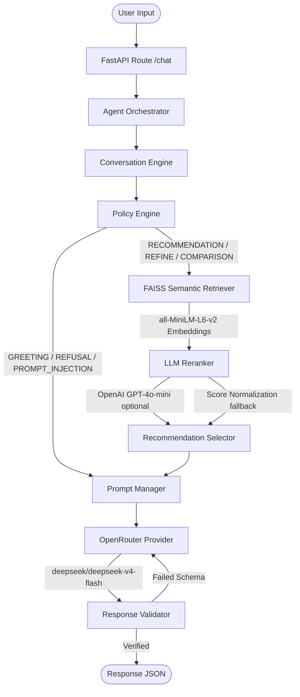

# SHL Assessment Recommender

A production-grade conversational recommendation agent built with **FastAPI** that recommends assessments from the official SHL product catalog. The system combines a FAISS semantic retrieval engine with a deterministic conversation policy layer and an OpenRouter-powered LLM grounding layer.

---

## Architecture Workflow Diagram

This flowchart illustrates the sequential execution pipeline inside the Agent Orchestrator:



---

## Key Features

* **FAISS Semantic Retrieval**: Dense vector search using `sentence-transformers/all-MiniLM-L6-v2` with metadata pre-filtering (language, duration, adaptive, remote, seniority).
* **LLM Reranker**: Optional OpenAI `gpt-4o-mini`-powered candidate reranker with score-normalization fallback when no key is configured.
* **Deterministic Policy Engine**: Maps extraction state contexts into clean execution policies (`GREETING`, `REFUSAL`, `PROMPT_INJECTION`, `CLARIFICATION`, `COMPARISON`, `END_CONVERSATION`).
* **Intelligent Clarification Logic**: Priority-ordered slot filling — queries only the single most critical missing value per turn (Role > Objective > Seniority > Duration > Language > Adaptive).
* **Grounded Prompting Layer**: Restricts the LLM payload strictly to retrieved, structured catalog data. Prevents hallucinated names and links through strict prompt rules.
* **Dual-Validation Pipeline**: Every LLM response is structurally parsed and validated against Pydantic schemas, with a single self-correction retry on JSON parse failures.
* **OpenRouter Integration**: Production LLM calls go through OpenRouter (default: `deepseek/deepseek-v4-flash`) with exponential backoff retry logic and graceful mock fallback for local testing.
* **AI Evaluation Framework**: Suite of 9+ golden recruiter scenarios executing E2E checks with TestClient, capturing latency, policy accuracy, retrieval quality (Recall, MRR), and grounding metrics.

---

## Project Structure

```text
shl-assessment-recommender/
|
+-- app/
|   +-- api/
|   |     routes.py                    # FastAPI endpoint handlers
|   |
|   +-- retrieval/
|   |     faiss_index.py               # FAISS vector index builder & loader
|   |     semantic.py                  # Semantic retriever with metadata filtering
|   |
|   +-- llm/
|   |     conversation_engine.py       # Intent & constraint context tracker
|   |     intent_detector.py           # Intent classification logic
|   |     clarification_planner.py     # Slot-filling clarification planner
|   |     recommendation_planner.py    # Retrieval query planner
|   |     comparison_planner.py        # Side-by-side comparison planner
|   |     conversation_analyzer.py     # Dialogue state analyzer
|   |     reranker.py                  # LLM reranker (OpenAI GPT-4o-mini)
|   |     prompt_builder.py            # Prompt construction helper
|   |     response_generator.py        # Response generation helper
|   |     response_validator.py        # LLM output validation
|   |
|   +-- prompts/
|   |     system.txt                   # Grounding rules system prompt
|   |     greeting.txt                 # Friendly greeting template
|   |     clarification.txt            # Missing slot template
|   |     recommendation.txt           # Retrieval presentation template
|   |     comparison.txt               # Assessment side-by-side template
|   |     refusal.txt                  # Out of scope template
|   |
|   +-- services/
|   |     orchestrator.py              # Brain coordinating engine/retrieval/LLM
|   |     prompt_manager.py            # Prompt template compiler
|   |     llm_provider.py              # OpenRouter client with retry + mock fallback
|   |     policy_engine.py             # State-to-action router
|   |     recommendation_selector.py   # Shortlisting & logic analyzer
|   |     recommendation_service.py    # Service initialization bridge
|   |     response_validator.py        # Pydantic grounding verification hooks
|   |
|   +-- models/
|   |     schemas.py                   # Request and response Pydantic schemas
|   |
|   +-- main.py                        # App startup and lifespan hook
|
+-- data/
|     shl_assessment_catalog.md        # Official SHL catalog source of truth
|
+-- frontend/                          # React + TypeScript conversational UI
|
+-- evaluation/
|   +-- benchmark_dataset.json         # Golden test scenarios
|   +-- benchmark_runner.py            # E2E test client execution harness
|   +-- metrics.py                     # Recall, Precision, MRR calculations
|   +-- report_generator.py            # Console dashboard and file exports
|   +-- evaluation_report.md           # Latest evaluation report
|
+-- tests/                             # Automated Pytest suite (43 tests)
+-- Dockerfile                         # Production Docker image
+-- docker-compose.yml                 # Local Docker Compose setup
+-- railway.json                       # Railway deployment configuration
+-- requirements.txt                   # Pinned Python dependencies
+-- DEPLOYMENT.md                      # Railway + Vercel deployment guide
+-- SUBMISSION_CHECKLIST.md            # Pre-submission compliance audit
+-- .env.example                       # Template configuration (no secrets)
```

---

## Installation & Getting Started

### Local Deployment

1. **Prepare Virtual Environment (Python 3.11+)**:
   ```bash
   python -m venv venv
   venv\Scripts\activate        # Windows
   source venv/bin/activate     # macOS/Linux
   ```

2. **Install Dependencies**:
   ```bash
   pip install -r requirements.txt
   ```

3. **Configure Environment Variables**:
   Copy `.env.example` to `.env` and fill in your values:
   ```ini
   # Required: LLM provider
   OPENROUTER_API_KEY=your_openrouter_key_here
   OPENROUTER_MODEL=deepseek/deepseek-v4-flash

   # Optional: LLM reranker (falls back to score normalization if not set)
   OPENAI_API_KEY=your_openai_key_here

   # Server config
   HOST=0.0.0.0
   PORT=8000
   CORS_ORIGINS=http://localhost:5173,http://localhost:3000
   ```

4. **Run Application**:
   ```bash
   uvicorn app.main:app --host 127.0.0.1 --port 8000
   ```
   Open Swagger UI at `http://127.0.0.1:8000/docs`.

5. **Run Frontend** (optional):
   ```bash
   cd frontend
   npm install
   npm run dev
   ```

### Docker

```bash
docker compose up --build
```

---

## API Endpoints

### 1. Health Status Check
* **Endpoint**: `GET /health`
* **Response**:
  ```json
  { "status": "ok" }
  ```

### 2. Conversational Chat Recommendation
* **Endpoint**: `POST /chat`
* **Request Schema**:
  ```json
  {
    "messages": [
      { "role": "user", "content": "I want to hire an entry-level Python developer." }
    ]
  }
  ```
* **Response Schema**:
  ```json
  {
    "reply": "Here are the best assessments for an Entry-Level Python Developer role.",
    "recommendations": [
      {
        "name": "Python (New)",
        "url": "https://www.shl.com/products/product-catalog/view/python-new/",
        "test_type": "K",
        "description": "...",
        "duration": "...",
        "adaptive": false,
        "remote": true,
        "languages": ["English (USA)"],
        "job_levels": ["Entry-Level", "Graduate"]
      }
    ],
    "end_of_conversation": true
  }
  ```

---

## Evaluation Report Card (Latest Results)

Evaluation runs 9 golden recruiter scenarios end-to-end using TestClient endpoints against the live pipeline.

| Metric Area | Parameter | Target | Value |
|---|---|---|---|
| **E2E Success** | Overall Success Rate | 100.0% | **100.00%** |
| **Conversation** | Intent Classifier Accuracy | 100.0% | **100.00%** |
| | Policy Engine Accuracy | 100.0% | **100.00%** |
| **Retrieval** | Recall@10 | Maximize | **88.89%** |
| | Mean Reciprocal Rank (MRR) | Maximize | **0.8889** |
| **Grounding** | Hallucination Rate | 0.00% | **0.00%** |
| | Invalid Link URL Rate | 0.00% | **0.00%** |
| | Grounding Success Rate | 100.0% | **100.00%** |
| **Response** | Completeness Rate | 100.0% | **100.00%** |
| **Performance** | Average E2E Latency | - | **0.6617 seconds** |

---

## Environment Variables Reference

| Variable | Required | Default | Description |
|---|---|---|---|
| `OPENROUTER_API_KEY` | **Yes** | - | OpenRouter API key for LLM calls |
| `OPENROUTER_MODEL` | No | `deepseek/deepseek-v4-flash` | Model to use via OpenRouter |
| `OPENAI_API_KEY` | No | - | Optional OpenAI key for LLM reranker |
| `HOST` | No | `0.0.0.0` | Server bind host |
| `PORT` | No | `8000` | Server port |
| `LOG_LEVEL` | No | `INFO` | Logging verbosity (`DEBUG`, `INFO`, `WARNING`) |
| `CORS_ORIGINS` | No | `*` | Comma-separated allowed CORS origins |
| `CATALOG_PATH` | No | `data/shl_assessment_catalog.md` | Path to catalog markdown file |
| `FAISS_INDEX_PATH` | No | `indexes/faiss.index` | Path to FAISS index file |
| `DEBUG` | No | `false` | Enable verbose pipeline debug logs |

---

## Running Tests

```bash
pytest tests/ -v
```

All 43 unit and integration tests should pass.
